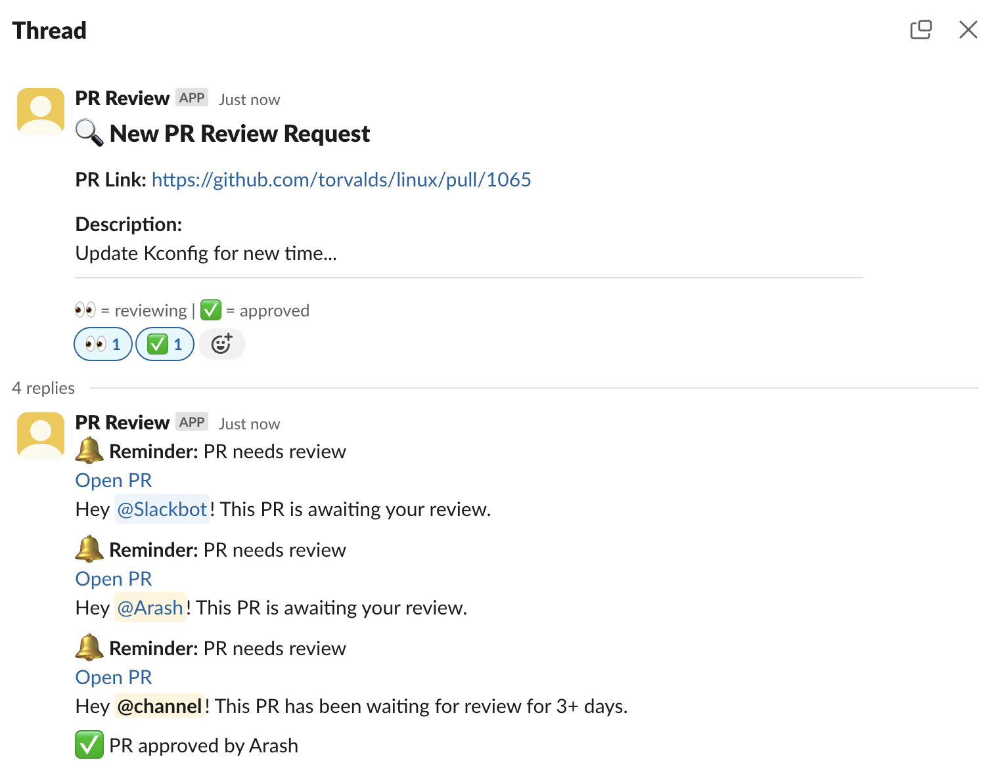

# PR review Slack app

This is a Slack app that helps with setting up reminder for PR reviews.

You will have your PR link with description and candidates to review the PR.
After publishing the message, in case the PR is not reviewed for a day (By reacting ✅ to the message), the app will remind the candidates, or people who have started reviewing the PR (by putting 👀 emoji on the initial message) that they need to check the PR.
Finally, on third day, the whole channel is mentioned for reviewing the PR.

Here's how it looks like:

## Setting up the app

First you need to create a Slack app and set it up properly:

1. Create a Slack App: https://api.slack.com/apps
2. Copy `example.env` file and fill the required secrets
    - Use `ngrok` if you intend to run the app locally
    - Set `GO_ENV` to anything other than "prod" to get shorter duration to running the scheduler
3. Run the app: `go run .`
4. Go to app's page and do the following:
    - In OAuth & Permissions section:
        - Add "chat:write" and "users:read" to "Bot Token Scopes"
        - Create Redirect URLs: `https://your-host.com/slack/oauth`
    - Create a Slash command
        - Request URL: `/slack/commands`
    - Enable "Interactivity & Shortcuts"
        - Request URL: `https://your-host.com/slack/interactivity`
    - Enable "Event Subscriptions:
        - Request URL: `https://your-host.com/slack/events`
        - Add "reaction_added" in "Subscribe to bot events"
5. Use `/pr` command in Slack to open the modal

## TODO
- [ ] Add rate limiter
- [ ] Make durations configurable
